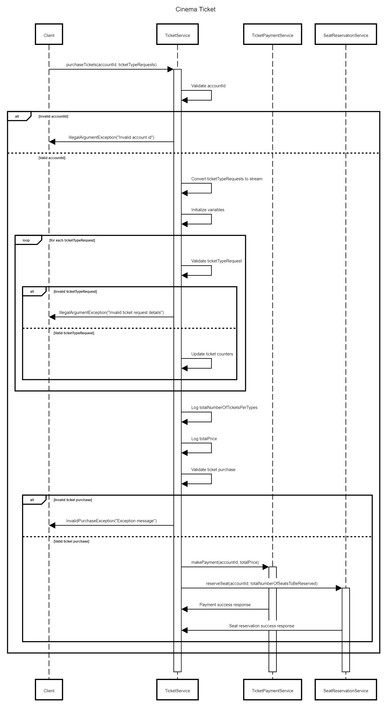

# Coding Exercise

## Objective

This coding exercise aims to assess your coding skills and approach to problem-solving. You will be evaluated based on the following criteria:

- Writing clean, well-tested, and reusable code.
- Ensuring compliance with specified business rules.

## Business Rules

- There are three types of tickets: Infant, Child, and Adult. 
- Ticket prices vary based on the ticket type.
- The ticket purchaser specifies the number and type of tickets they want to buy.
- Multiple tickets can be purchased at once, but a maximum of 20 tickets is allowed.
- Infants do not require a ticket or a seat.
- Child and Infant tickets must be purchased with an Adult ticket.

    | Ticket Type | Price |
    |-------------|-------|
    | INFANT      | £0    |
    | CHILD       | £10   |
    | ADULT       | £20   |

- Existing services are available:
    - `TicketPaymentService`: Handles payment processing.
    - `SeatReservationService`: Handles seat reservation.

## Constraints

- The `TicketService` interface cannot be modified (Java solution only).
- The code in the `thirdparty.*` packages cannot be modified.
- The `TicketTypeRequest` object must be immutable.

## Assumptions

The following assumptions can be made:

- All accounts with an ID greater than zero are valid and have sufficient funds to purchase any number of tickets.
- The `TicketPaymentService` implementation is an external provider without any defects. The payment process is not a concern.
- Once a payment request is made to the `TicketPaymentService`, the payment will always go through.
- The `SeatReservationService` implementation is an external provider without any defects. The seat reservation algorithm is not a concern.
- Once a reservation request is made to the `SeatReservationService`, the seat will always be reserved.

## Your Task

Your task is to provide a working implementation of the `TicketService` that fulfills the following requirements:

- Considers the objective, business rules, constraints, and assumptions mentioned above.
- Calculates the correct amount for the requested tickets and sends a payment request to the `TicketPaymentService`.
- Calculates the correct number of seats to reserve and sends a reservation request to the `SeatReservationService`.
- Rejects any invalid ticket purchase requests. You should define what constitutes an invalid purchase request.

## High Level Purchase Flow Details

The high-level design of the `purchaseTickets` method can be represented as an arrow diagram in text format. Here's the representation:

 

In this design, the main steps of the `purchaseTickets` method are outlined:

1. Input Validation: The method starts by validating the input parameters, such as checking if the `accountId` is null or if any of the `ticketTypeRequests` are null. If any validation fails, an appropriate exception is thrown.

2. Process Ticket Requests: The method processes each ticket request in the array. It calculates the total number of tickets, tracks the number of tickets per type, and calculates the total price for the tickets.

3. Validate Account ID: After processing the ticket requests, the method validates the ticket purchase by checking if it meets certain criteria, such as the maximum limit of tickets per purchase, the number of infants exceeding the number of adults, or the absence of an adult ticket when purchasing child or infant tickets. If any validation fails, an exception is thrown.

4. Make Payment Using Service: If the ticket purchase passes validation, the method proceeds to make the payment using the ticket payment service, passing the `accountId` and the total price.

5. Calculate Statistics and Total Prices: The method calculates additional statistics, such as the total number of seats to be reserved, excluding infant tickets. It also calculates the total price for the ticket purchase.

6. Reserve Seats: Once the payment is successful, the method reserves the required number of seats using the seat reservation service, passing the `accountId` and the total number of seats to be reserved.

7. Log Reservation Status: Finally, the method logs the status of the seat reservation, providing information about the total number of tickets and seats to be reserved.

Throughout the process, exceptions are handled appropriately, ensuring that any errors or invalid scenarios are captured and handled accordingly.
The implementation handles error cases such as invalid account ID and ticket request details by throwing appropriate exceptions. It also logs relevant information for tracking and debugging purposes.

## Technology Used: OpenJDK 17, Maven 3.6.3

## Command : `mvn clean install`

